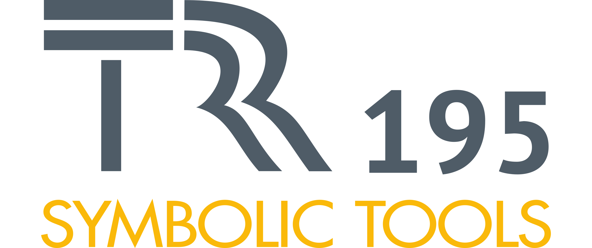
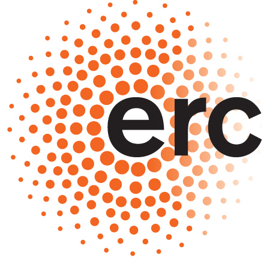
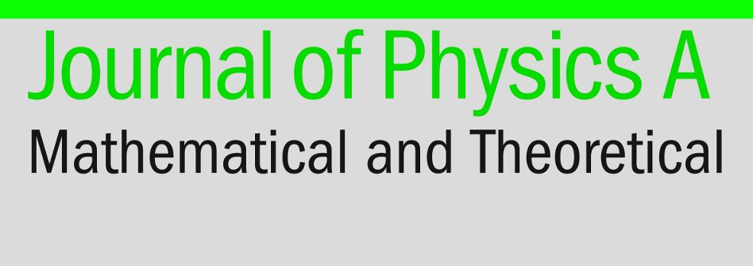

# {{ site.title }}

## {{ site.description }}  {{ site.location }}

<!-- ## The idea of this workshop series in general -->

The combination of quantum physics with information theory has posed
new challenges for physicists and mathematicians. To further develop
the field, researchers need to learn methods and understand open
challenges in an interdisciplinary manner. On the mathematical side,
results in algorithmic algebra, convex optimization, and multilinear
algebra provide novel tools for tackling physical problems. In
physics, open questions in entanglement theory, information processing
and many-body systems are waiting for the mathematical advances to
solve them. This workshop aims at bringing together researchers from
both communities to exchange ideas and methods in an informal manner.

More detailed information can be found on [the program page]({{ site.baseurl }}/program).

## Invited speakers (incomplete list)

* Timo de Wolff (TU Braunschweig)
* Barbara Kraus (U Innsbruck, Austria)
* Markus Lange-Hegermann (FH Ostwestfalen Lippe)
* Miguel Navascues (Austrian academy of sciences)
* Roman Orus (DIPC, San Sebastian, Spain)
* Liqun Qi (U Hong Kong, China)
<!--* Andreas Winter (U Autonoma Barcelona, Spain)-->

## Registering and stay

The workshop will take place at the {{ site.location }}. Information about the
exact location and accommodation options
can be found on [the location page]({{ site.baseurl }}/location).
Please [register]({{ site.baseurl }}/registration) if you plan to attend, to help us better prepare the event.

##  Contact

If you have questions or suggestions, please contact the organizers:

* [Mohamed Barakat](mailto:mohamed.barakat@uni-siegen.de)
* [Otfried Gühne](mailto:otfried.guehne@uni-siegen.de)
* [Matthias Kleinmann](mailto:matthias.kleinmann@uni-siegen.de)
* [Thorsten Raasch](mailto:Raasch@mathematik.uni-siegen.de)

## Sponsors

This workshop is supported by
* [SFB-TRR 195](https://www.computeralgebra.de/sfb/) -- Symbolic Tools in Mathematics and their Application;
* ERC Consolidator Grant, Temporal Quantum Correlations.
* Journal of Physics A

 
 
 
 

## Previous and future workshops

Please visit <https://MoQIT.github.io/> for a list of all workshops.
